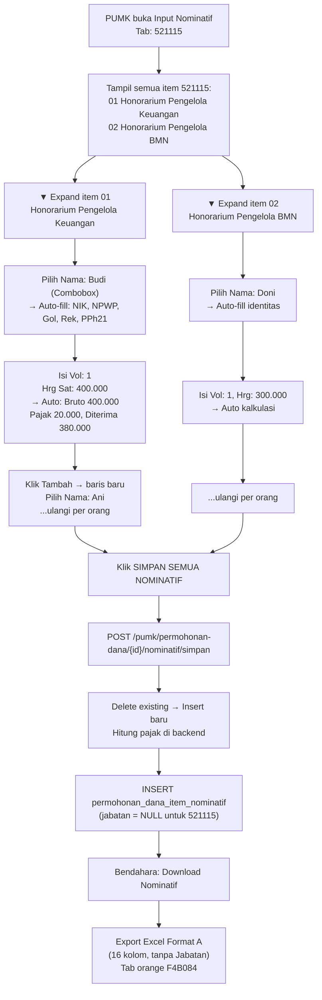

# Alur Pengisian Nominatif 521115 — Honorarium Operasional Satuan Kerja

## Jawaban Singkat

Pengisian dilakukan **per orang** untuk setiap item rincian biaya berkode `521115`. PUMK memilih nama peserta dari master data pegawai, mengisi volume (jumlah kegiatan/jam), dan harga satuan. **Tidak ada kolom Jabatan** di Format A ini — berbeda dengan 521213/522151.

---

## Siapa yang Mengisi?

| Role | Aksi |
|------|------|
| **PUMK (role pumk)** | Mengisi seluruh data nominatif per orang per item |
| **Bendahara** | Hanya klik "Download Nominatif" → Export Excel |

> [!IMPORTANT]
> **PUMK yang melakukan seluruh pengisian.** Bendahara hanya men-generate output Excel.

---

## Perbedaan Format A vs Format B

| Aspek | Format A (521115) | Format B (521213, 522151) |
|-------|-------------------|--------------------------|
| Kolom Jabatan | ❌ Tidak ada | ✅ Ada (Ketua, Anggota, dll) |
| Judul Excel | "DAFTAR PEMBAYARAN HONORARIUM OPERASIONAL" | "DAFTAR PEMBAYARAN HONORARIUM PANITIA" / "NARASUMBER" |
| Kolom Excel | A–P (16 kolom) | A–Q (17 kolom) |

---

## Alur Pengisian Step-by-Step

### Contoh Kasus:
```
521115 - Honorarium Operasional Satuan Kerja
├── 01 Honorarium Pengelola Keuangan  [12 OB x 1 KEG]
└── 02 Honorarium Pengelola BMN       [12 OB x 1 KEG]
```

### Step 1: PUMK membuka halaman Input Nominatif

PUMK membuka halaman **Input Nominatif** dari permohonan dana yang berstatus `draft` atau `rejected`. Halaman menampilkan tab per kode akun. PUMK klik tab `521115`.

```
┌─────────────────────────────────────────────────────────────────┐
│ Tab: [521115] [521213] [524111] ...                             │
├─────────────────────────────────────────────────────────────────┤
│ 521115 — Honorarium Operasional Satuan Kerja                   │
│                                                                 │
│ ▼ 01 Honorarium Pengelola Keuangan  [12 OB × Rp 400.000]      │
│ ┌────┬──────────────────┬─────┬────────────┬────────┬──────┐   │
│ │ No │ Nama Peserta     │ Vol │ Harga Sat  │ Jumlah │ PPh  │   │
│ ├────┼──────────────────┼─────┼────────────┼────────┼──────┤   │
│ │  1 │ [Combobox ▼]     │  1  │  400.000   │ auto   │  5%  │   │
│ │  + Tambah Peserta                                         │   │
│ └───────────────────────────────────────────────────────────┘   │
│                                                                 │
│ ▼ 02 Honorarium Pengelola BMN  [12 OB × Rp 300.000]           │
│ ...                                                             │
└─────────────────────────────────────────────────────────────────┘
```

### Step 2: PUMK mengisi data per orang per item

Untuk setiap item `521115`, PUMK menambahkan baris per orang:

#### Field yang diisi PUMK:

| Field | Cara Input | Keterangan |
|-------|-----------|------------|
| **Nama Peserta** | Combobox searchable dari `ref_pegawai` | Ketik nama → pilih dari dropdown |
| **Volume** | Input angka | Jumlah kegiatan/bulan/jam. Default: 1 |
| **Harga Satuan** | Input angka | Default dari `harga_satuan` item, bisa diedit |
| **PPh21 (%)** | Auto dari pegawai, editable | Misal: 5% untuk Gol III |

#### Field yang otomatis terisi saat pilih nama:

| Field | Sumber |
|-------|--------|
| NIK | `ref_pegawai.nik` |
| NPWP | `ref_pegawai.npwp` |
| Gol/Ruang | `ref_pegawai.gol_ruang` |
| Nama Rekening | `ref_pegawai.nama_rekening` |
| Nomor Rekening | `ref_pegawai.norek` |
| Bank | `ref_pegawai.nama_bank` |
| Email | `ref_pegawai.email` |
| PPh21 | `ref_pegawai.pph21` |

> Field identitas ini **tidak tampil di tabel** tapi dikirim ke server saat simpan (hidden fields).

### Step 3: Kalkulasi otomatis

Sistem menghitung otomatis:

```
Jumlah Bruto  = Volume × Harga Satuan
Jumlah Pajak  = Jumlah Bruto × (PPh21 / 100)
Jumlah Diterima = Jumlah Bruto − Jumlah Pajak
```

Contoh:
```
Vol: 1 × Hrg: 400.000 = Bruto: 400.000
PPh21: 5% → Pajak: 20.000
Diterima: 380.000
```

### Step 4: Simpan semua

Klik tombol **"Simpan Semua Nominatif"** → semua data semua item dikirim sekaligus ke `POST /pumk/permohonan-dana/{id}/nominatif/simpan`.

---

## Detail Teknis Penyimpanan

### Tabel `permohonan_dana_item_nominatif` — kolom yang dipakai untuk 521115:

```
permohonan_dana_item_id  → FK ke item 521115
permohonan_dana_id       → FK ke permohonan
ref_pegawai_id           → FK ke ref_pegawai (nullable jika input manual)
nama                     → snapshot nama
nip, nik, npwp, gol_ruang, nama_rekening, norek, nama_bank, email, pph21  → snapshot identitas
jabatan                  → NULL (tidak dipakai di Format A)
volume                   → jumlah kegiatan/jam
harga_satuan             → harga per satuan
jumlah_bruto             → volume × harga_satuan (generated/computed)
jumlah_pajak             → jumlah_bruto × (pph21/100)
jumlah_diterima          → jumlah_bruto − jumlah_pajak
```

> Kolom perjadin (`transport`, `uang_harian_*`, `hotel`, dll) **tidak dipakai** untuk kode honor.

---

## Format Excel Output (Format A)

Header baris 9–11:

```
No | Nama | NIK | NPWP | Gol | Honorarium [Jml Keg | Rp/Jam | Jml Bruto] | DPP [PNS/Non PNS] | PPH21 [Tarif | Jml Pajak] | Jumlah Diterima | Atas Nama Rekening | Nomor Rekening | Bank | Email
```

Kolom A–P (16 kolom). **Tidak ada kolom Jabatan.**

Header (baris 1–11, dari kode asli controller):
```
Baris 1: "Lampiran :"
Baris 2: "Surat Keputusan Kepala LLDIKTI Wilayah III selaku KPA"
Baris 3: "Nomor : {no_sk} Tanggal {tgl_sk}"
Baris 5: "DAFTAR PEMBAYARAN HONORARIUM OPERASIONAL SATUAN KERJA"
Baris 6: "BULAN XXX {tahun_anggaran}"   ← BUKAN nama kegiatan, berbeda dari 521213/522151
Baris 7: "521115 {nama_subkegiatan}"
```

> [!IMPORTANT]
> **521115 berbeda dari 521213/522151:** Baris 6 berisi "BULAN XXX {tahun}" — tidak ada baris kegiatan/tempat/tanggal. Header data mulai di baris 9 (bukan 11).

Data header kolom (baris 9–11):
```
Baris 9:  No | Nama | NIK | NPWP | Gol | Honorarium | DPP | PPH 21 | Jumlah Diterima | Atas Nama Rekening | Nomor Rekening | Bank | Email
Baris 10: (sub-header: Jml Keg | Rp./Jam | Jml Bruto | PNS/Non PNS | Tarif** | Jml Pajak)
Baris 11: A | B | C | D | E | F | G | H=FxG | I=H | J | K=(JxI) | L=(H-K) | M | N | O | P
```

Tab color Excel: **F4B084** (orange — kode honor).

---

## Diagram Alur Lengkap



---

## Opsi Jabatan

**Tidak ada.** Format A (521115) tidak memiliki kolom jabatan. Berbeda dengan Format B (521213/522151) yang memiliki dropdown jabatan: Ketua, Wakil Ketua, Sekretaris, Anggota, Penanggung Jawab.

---

## Tarif PPh21 Referensi

| Kondisi Pegawai | Tarif PPh21 |
|----------------|-------------|
| PNS Golongan II (II/b, II/c, II/d) | 0% |
| PNS Golongan III (III/a–III/d) | 5% |
| PNS Golongan IV (IV/a–IV/e) | 15% |
| Non PNS + punya NPWP | 3% |
| Non PNS + tanpa NPWP | 2.5% |

---

## Kesimpulan

| Pertanyaan | Jawaban |
|-----------|---------|
| **Ada kolom Jabatan?** | **Tidak.** Format A tidak punya kolom jabatan. |
| **Input per orang atau total?** | **Per orang.** Setiap peserta diinput satu baris. |
| **Siapa yang mengisi?** | **PUMK** mengisi semua. Bendahara hanya export Excel. |
| **Pajak dihitung otomatis?** | **Ya.** Berdasarkan PPh21 dari data master pegawai. |
| **Kolom Excel berapa?** | **16 kolom (A–P).** Tanpa kolom Jabatan. |
| **Warna tab Excel?** | **Orange (F4B084)** — sama dengan semua kode honor. |
