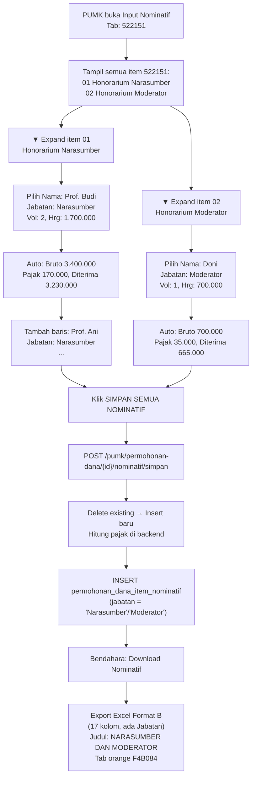

# Alur Pengisian Nominatif 522151 — Belanja Jasa Profesi (Narasumber)

## Jawaban Singkat

Pengisian dilakukan **per orang** untuk setiap item rincian biaya berkode `522151`. PUMK memilih nama peserta, mengisi **Jabatan dalam Tugas** (Narasumber, Moderator, dll), volume (jam/sesi), dan harga satuan. Format B ini sama strukturnya dengan 521213, namun judul Excel berbeda: **"DAFTAR PEMBAYARAN HONORARIUM NARASUMBER DAN MODERATOR"**.

---

## Siapa yang Mengisi?

| Role | Aksi |
|------|------|
| **PUMK (role pumk)** | Mengisi seluruh data nominatif per orang per item |
| **Bendahara** | Hanya klik "Download Nominatif" → Export Excel |

> [!IMPORTANT]
> **PUMK yang melakukan seluruh pengisian.** Bendahara hanya men-generate output Excel.

---

## Perbedaan 522151 vs 521213 (sama-sama Format B)

| Aspek | 522151 (Narasumber) | 521213 (Panitia) |
|-------|---------------------|-----------------|
| Judul Excel | "DAFTAR PEMBAYARAN HONORARIUM NARASUMBER DAN MODERATOR" | "DAFTAR PEMBAYARAN HONORARIUM PANITIA" |
| Opsi Jabatan | Narasumber, Moderator | Ketua, Wakil Ketua, Sekretaris, Anggota, Penanggung Jawab |
| Kolom Excel | A–Q (17 kolom) | A–Q (17 kolom) |
| Tab color | Orange F4B084 | Orange F4B084 |

---

## Alur Pengisian Step-by-Step

### Contoh Kasus:
```
522151 - Belanja Jasa Profesi
├── 01 Honorarium Narasumber  [2 OJ x 1 KEG]
└── 02 Honorarium Moderator   [1 OJ x 1 KEG]
```

### Step 1: PUMK membuka halaman Input Nominatif

PUMK membuka halaman **Input Nominatif** dari permohonan dana yang berstatus `draft` atau `rejected`. Klik tab `522151`.

```
┌─────────────────────────────────────────────────────────────────────┐
│ Tab: [521213] [522151] [524111] ...                                 │
├─────────────────────────────────────────────────────────────────────┤
│ 522151 — Belanja Jasa Profesi (Narasumber)                         │
│                                                                     │
│ ▼ 01 Honorarium Narasumber  [2 OJ × Rp 1.700.000]                 │
│ ┌────┬──────────────────┬──────────────────┬─────┬────────┬──────┐  │
│ │ No │ Nama Peserta     │ Jabatan          │ Vol │ Jumlah │ PPh  │  │
│ ├────┼──────────────────┼──────────────────┼─────┼────────┼──────┤  │
│ │  1 │ [Combobox ▼]     │ [Narasumber ▼]   │  2  │ auto   │  5%  │  │
│ │  + Tambah Peserta                                               │  │
│ └─────────────────────────────────────────────────────────────────┘  │
│                                                                     │
│ ▼ 02 Honorarium Moderator  [1 OJ × Rp 700.000]                    │
│ ...                                                                 │
└─────────────────────────────────────────────────────────────────────┘
```

### Step 2: PUMK mengisi data per orang per item

#### Field yang diisi PUMK:

| Field | Cara Input | Keterangan |
|-------|-----------|------------|
| **Nama Peserta** | Combobox searchable dari `ref_pegawai` | Ketik nama → pilih dari dropdown |
| **Jabatan dalam Tugas** | Dropdown pilihan | Narasumber atau Moderator |
| **Volume** | Input angka | Jumlah jam/sesi. Default: 1 |
| **Harga Satuan** | Input angka | Default dari `harga_satuan` item, bisa diedit |
| **PPh21 (%)** | Auto dari pegawai, editable | Misal: 5% untuk Gol III |

#### Opsi Jabatan dalam Tugas (522151) — dari kode asli `edit_anggaran.php`:

| Pilihan Jabatan (nilai `keterangan`) |
|--------------------------------------|
| Honorarium Narasumber (Pejabat Eselon II) |
| Honorarium Narasumber (Pejabat Eselon III) |
| Honorarium Moderator |
| Honorarium Redaktur (Managing Editor) |
| Honorarium Penyunting/Editor |
| Honorarium Sekretariat |
| Honorarium Pembawa Acara |

> Nilai ini disimpan di field `keterangan` di `detail_anggaran_ref`, dan dipakai langsung sebagai isi kolom "Jabatan Dalam Tugas" di Excel.

#### Field yang otomatis terisi saat pilih nama:

| Field | Sumber |
|-------|--------|
| NIK | `ref_pegawai.nik` |
| NPWP | `ref_pegawai.npwp` |
| Gol/Ruang | `ref_pegawai.gol_ruang` |
| Nama Rekening | `ref_pegawai.nama_rekening` |
| Nomor Rekening | `ref_pegawai.norek` |
| Bank | `ref_pegawai.nama_bank` |
| Email | `ref_pegawai.email` |
| PPh21 | `ref_pegawai.pph21` |

### Step 3: Kalkulasi otomatis

```
Jumlah Bruto    = Volume × Harga Satuan
Jumlah Pajak    = Jumlah Bruto × (PPh21 / 100)
Jumlah Diterima = Jumlah Bruto − Jumlah Pajak
```

Contoh:
```
Vol: 2 × Hrg: 1.700.000 = Bruto: 3.400.000
PPh21: 5% → Pajak: 170.000
Diterima: 3.230.000
```

### Step 4: Simpan semua

Klik tombol **"Simpan Semua Nominatif"** → semua data dikirim ke `POST /pumk/permohonan-dana/{id}/nominatif/simpan`.

---

## Detail Teknis Penyimpanan

### Tabel `permohonan_dana_item_nominatif` — kolom yang dipakai untuk 522151:

```
permohonan_dana_item_id  → FK ke item 522151
permohonan_dana_id       → FK ke permohonan
ref_pegawai_id           → FK ke ref_pegawai
nama, nip, nik, npwp, gol_ruang, nama_rekening, norek, nama_bank, email, pph21  → snapshot
jabatan                  → "Narasumber" / "Moderator"
volume                   → jumlah jam/sesi
harga_satuan             → harga per jam/sesi
jumlah_bruto             → volume × harga_satuan
jumlah_pajak             → jumlah_bruto × (pph21/100)
jumlah_diterima          → jumlah_bruto − jumlah_pajak
```

> Kolom perjadin (`transport`, `uang_harian_*`, `hotel`, dll) **tidak dipakai** untuk kode honor.

---

## Format Excel Output (Format B)

Header baris 11–13:

```
No | Nama | Jabatan Dalam Tugas | NIK | NPWP | Gol | Honorarium [Jml Keg | Rp/Jam | Jml Bruto] | DPP [PNS/Non PNS] | PPH21 [Tarif | Jml Pajak] | Jumlah Diterima | Atas Nama Rekening | Nomor Rekening | Bank | Email
```

Kolom A–Q (17 kolom). **Ada kolom Jabatan Dalam Tugas** di posisi kolom C.

Header (baris 1–13, dari kode asli controller):
```
Baris 1: "Lampiran :"
Baris 2: "Surat Keputusan Kepala LLDIKTI Wilayah III selaku KPA"
Baris 3: "Nomor : {no_sk} Tanggal {tgl_sk}"
Baris 5: "DAFTAR PEMBAYARAN HONORARIUM NARASUMBER DAN MODERATOR"
Baris 6: "KEGIATAN {JUDUL_KEGIATAN_UPPERCASE}"
Baris 7: "DI LINGKUNGAN LEMBAGA LAYANAN PENDIDIKAN TINGGI WILAYAH III JAKARTA TAHUN ANGGARAN {tahun}"
Baris 8: "DI {TEMPAT_UPPERCASE} TANGGAL {tgl_pelaksanaan_uppercase}"
Baris 9: "522151 {nama_subkegiatan}"
```

Data header kolom (baris 11–13):
```
Baris 11: No | Nama | Jabatan Dalam Tugas | NIK | NPWP | Gol | Honorarium | DPP | PPH 21 | Jumlah Diterima | Atas Nama Rekening | Nomor Rekening | Bank | Email
Baris 12: (sub-header: Jml Keg | Rp./Jam | Jml Bruto | PNS/Non PNS | Tarif** | Jml Pajak)
Baris 13: A | B | C | D | E | F | G | H=FxG | I=H | J | K=(JxI) | L=(H-K) | M | N | O | P | Q
```

> [!IMPORTANT]
> **Jabatan diambil dari field `keterangan`** di tabel `detail_anggaran_ref` (untuk TA >= 2024). Nilai yang valid: "Honorarium Narasumber (Pejabat Eselon II)", "Honorarium Narasumber (Pejabat Eselon III)", "Honorarium Moderator", dll — sesuai opsi dropdown di form edit anggaran.

Tab color Excel: **F4B084** (orange — kode honor).

---

## Diagram Alur Lengkap



---

## Tarif PPh21 Referensi

| Kondisi Pegawai | Tarif PPh21 |
|----------------|-------------|
| PNS Golongan II (II/b, II/c, II/d) | 0% |
| PNS Golongan III (III/a–III/d) | 5% |
| PNS Golongan IV (IV/a–IV/e) | 15% |
| Non PNS + punya NPWP | 3% |
| Non PNS + tanpa NPWP | 2.5% |

> Narasumber dari luar instansi biasanya Non PNS → tarif 3% (punya NPWP) atau 2.5% (tanpa NPWP).

---

## Kesimpulan

| Pertanyaan | Jawaban |
|-----------|---------|
| **Ada kolom Jabatan?** | **Ya.** Format B punya kolom Jabatan Dalam Tugas. |
| **Opsi jabatan apa saja?** | **Narasumber** dan **Moderator** saja (berbeda dari 521213). |
| **Input per orang atau total?** | **Per orang.** Setiap peserta diinput satu baris. |
| **Siapa yang mengisi?** | **PUMK** mengisi semua. Bendahara hanya export Excel. |
| **Kolom Excel berapa?** | **17 kolom (A–Q).** Ada kolom Jabatan. |
| **Warna tab Excel?** | **Orange (F4B084)** — sama dengan semua kode honor. |
| **Judul Excel?** | "DAFTAR PEMBAYARAN HONORARIUM NARASUMBER DAN MODERATOR" |
| **Referensi dokumen?** | Nomor SK dan Tanggal SK. |
