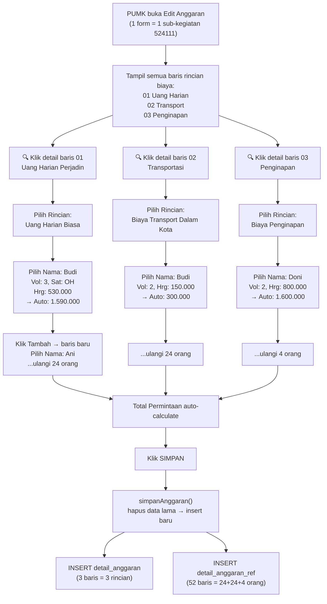

# Alur Pengisian Nominatif 524111 — Perjalanan Dinas

## Jawaban Singkat

Pengisian dilakukan **SATU-SATU per rincian biaya (per baris pekerjaan)**, dan **per orang**. PUMK **tidak mengisi total dulu** — melainkan masuk ke **setiap baris rincian biaya**, klik detail (🔍), lalu menambahkan nama-nama orang beserta volume dan harga satuan masing-masing.

---

## Siapa yang Mengisi?

| Role | Aksi |
|------|------|
| **PUMK (role 7)** | Mengisi seluruh data rincian biaya + daftar nama orang per rincian |
| **Bendahara (role 5)** | Hanya klik "Buat Daftar Nominative" → Download Excel |

> [!IMPORTANT]
> **PUMK yang melakukan seluruh pengisian.** Bendahara hanya men-generate output Excel.

---

## Alur Pengisian Step-by-Step

### Contoh Kasus:
```
524111 - Perjalanan Dinas Dalam Negeri
├── 01 Uang Harian Perjalanan Dinas Luar Kota (Jawa Barat) [24 ORG x 3 HR x 4 KEG]
├── 02 Satuan biaya transportasi jakarta ke kota bekasi    [24 ORG x 2 KL x 4 KEG]
└── 03 Biaya Penginapan Luar Kota                         [4 ORG x 2 KL x 4 KEG]
```

### Step 1: PUMK membuka halaman Edit Anggaran per Sub-Kegiatan

PUMK membuka form **Edit Anggaran** yang menampilkan **SEMUA rincian biaya** dalam 1 halaman/1 form. Tampilannya berupa tabel:

```
┌─────────────────────────────────────────────────────────────────┐
│ 524111 - Perjalanan Dinas Dalam Negeri  [Dana: Rp 500.000.000] │
│ Telah digunakan Rp 0 , sisa anggaran Rp 500.000.000           │
├──────────────────────────────────┬────┬────┬──────┬──────┬──────┤
│ Uraian                          │Vol │Sat │HrgSat│Jml   │Aksi  │
├──────────────────────────────────┼────┼────┼──────┼──────┼──────┤
│ 01 Uang Harian Perjadin LK      │288 │OH  │530rb │152jt │ 🔍  │
│ 02 Transportasi Jkt-Bekasi       │192 │OK  │-     │-     │ 🔍  │  
│ 03 Biaya Penginapan Luar Kota    │32  │OHR │-     │-     │ 🔍  │
├──────────────────────────────────┴────┴────┴──────┴──────┴──────┤
│                                         Total: Rp 0            │
│ [Simpan]  [Tambah Referensi]                                   │
└────────────────────────────────────────────────────────────────-┘
```

### Step 2: PUMK klik 🔍 (Detail) pada SETIAP rincian biaya — SATU PER SATU

Saat PUMK klik icon 🔍 pada baris **"01 Uang Harian Perjadin"**, muncul **sub-tabel** di bawahnya:

```
┌──────────────────────────────────────────────────────────────────┐
│ [Dropdown: Silakan Pilih Rincian ▼]  [Tambah] [Show/Hide]       │
├──────────────────────────────────────────────────────────────────┤
│ Nama              │ Detail Identitas│ Rekening │Vol│Sat│HrgSat│Jml│
├───────────────────┼─────────────────┼──────────┼───┼───┼──────┼───┤
│ [Pilih Nama ▼]    │ NIK: ...        │ Rek: ... │ 3 │OH │530rb │1.5jt│
│    Keterangan: Uang Harian Biasa                                │
│ [Pilih Nama ▼]    │ NIK: ...        │ Rek: ... │ 3 │OH │530rb │1.5jt│
│    Keterangan: Uang Harian Biasa                                │
│ ... (24 orang)                                                  │
│ [Pilih Nama ▼]    │ (baris kosong untuk tambah orang baru)      │
└──────────────────────────────────────────────────────────────────┘
```

#### Yang diinput PUMK per orang per rincian:

| Field | Cara Input | Keterangan |
|-------|-----------|------------|
| **Nama** | Dropdown `ref_nama[]` (Select2) | Pilih dari master data pegawai |
| **Keterangan** | Dropdown `posisi[]` → otomatis isi `keterangan[]` | Pilih jenis biaya: "Uang Harian Biasa", "Biaya Transport Dalam Kota", dll |
| **Volume** | Input manual `vol_ref[id_pekerjaan][]` | Misal: 3 (hari) |
| **Satuan** | Input manual `satuan_ref[id_pekerjaan][]` | Misal: "OH" |
| **Harga Satuan** | Input/auto `hrg_satuan_ref[id_pekerjaan][]` | Misal: 530.000 |
| **Jumlah** | Auto-calculate (readonly) | = Volume × Harga Satuan |

> Identitas (NIK, NPWP, Gol, Rekening) **otomatis terisi** dari data master `ref_nama` saat PUMK memilih nama.

### Step 3: Ulangi untuk setiap baris rincian biaya

PUMK **HARUS** klik 🔍 pada **baris 02 (Transportasi)** dan **baris 03 (Penginapan)** juga, lalu mengisi nama-nama orang yang relevan di setiap rincian tersebut.

### Step 4: Simpan semua sekaligus

Klik tombol **"Simpan"** → semua data **semua rincian + semua orang** dikirim dalam **1 form submit** ke `simpanAnggaran()`.

---

## Detail Teknis Penyimpanan

### Saat submit, sistem menyimpan ke 2 tabel:

#### 1. `detail_anggaran` — total per baris rincian (auto-sum dari referensi)

```
id_permohonan_da | id_subkegiatan_da | id_pekerjaan_da | volume_da | harga_satuan_da | total_da
1                | 5 (524111)        | 10 (Uang Harian)| 72        | 530000          | 38160000
1                | 5 (524111)        | 11 (Transport)  | 48        | 150000          | 7200000
1                | 5 (524111)        | 12 (Penginapan) | 8         | 800000          | 6400000
```

> `volume_da` = **SUM dari semua vol_ref** orang-orang di rincian tersebut (baris 661 controller)

#### 2. `detail_anggaran_ref` — detail per orang per rincian

```
id_permohonan_dar | id_subkegiatan_dar | id_pekerjaan_dar | id_ref_dar | vol_dar | satuan_dar | harga_satuan_dar | jml_minta_dar | keterangan
1                 | 5                  | 10 (Uang Harian) | 101 (Budi) | 3       | OH         | 530000           | 1590000       | Uang Harian Biasa
1                 | 5                  | 10 (Uang Harian) | 102 (Ani)  | 3       | OH         | 530000           | 1590000       | Uang Harian Biasa
1                 | 5                  | 11 (Transport)   | 101 (Budi) | 2       | OK         | 150000           | 300000        | Biaya Transport...
1                 | 5                  | 12 (Penginapan)  | 103 (Doni) | 2       | OHR        | 800000           | 1600000       | Biaya Penginapan...
```

---

## Diagram Alur Lengkap



---

## Opsi Rincian per Kode Akun

Saat klik dropdown "Silakan Pilih Rincian", opsi yang muncul **berbeda per kode akun**. Untuk `524111`:

| Opsi Rincian |
|-------------|
| Biaya Transport Luar Kota/Tiket Pesawat/Kereta Api/Angkutan Umum |
| Uang Harian Biasa |
| Uang Harian Fullboard |
| Uang Harian Fullday/halfday |
| Uang Representasi Pejabat Eselon II |
| Biaya Penginapan/Hotel Luar Kota |

> Field `keterangan` inilah yang nanti digunakan saat export Excel untuk menentukan **di kolom mana** data orang tersebut ditempatkan (Transport → kolom C, Uang Harian Biasa → kolom D/E/F, dll).

---

## Kesimpulan

| Pertanyaan | Jawaban |
|-----------|---------|
| **Input 1-1 atau total dulu?** | **Satu-satu per orang, per rincian biaya.** Tidak ada input total dulu. |
| **Semua rincian ditampilkan bersamaan?** | **Ya**, semua rincian (01, 02, 03) ditampilkan dalam 1 form. PUMK klik 🔍 untuk expand detail setiap rincian. |
| **Siapa yang mengisi?** | **PUMK (role 7)** mengisi semua. Bendahara hanya generate Excel. |
| **Kapan total muncul?** | Total di baris utama **auto-calculate** dari SUM jumlah semua orang di detail rincian tersebut. |
| **Bagaimana mapping ke kolom Excel?** | Field `keterangan` (dipilih dari dropdown) menentukan kolom Excel saat export nominatif. |
