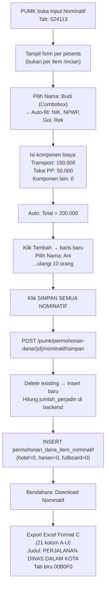

# Alur Pengisian Nominatif 524113 — Belanja Perjalanan Dinas Dalam Kota

## Jawaban Singkat

Pengisian dilakukan **per orang** dengan mengisi komponen biaya perjalanan dinas dalam kota. Karena perjalanan dalam kota (tidak menginap), komponen yang relevan biasanya hanya **transport** dan **taksi PP** — tidak ada uang harian biasa, fullboard, atau hotel. Format C sama dengan 524111/524119, namun komponen yang diisi lebih sedikit.

---

## Siapa yang Mengisi?

| Role | Aksi |
|------|------|
| **PUMK (role pumk)** | Mengisi seluruh data nominatif per orang per item |
| **Bendahara** | Hanya klik "Download Nominatif" → Export Excel |

> [!IMPORTANT]
> **PUMK yang melakukan seluruh pengisian.** Bendahara hanya men-generate output Excel.

---

## Perbedaan 524113 vs 524111 vs 524119

| Aspek | 524113 (Dalam Kota) | 524111 (Perjadin Biasa LK) | 524119 (Paket Meeting LK) |
|-------|---------------------|---------------------------|--------------------------|
| Konteks | Perjalanan dalam kota, tidak menginap | Perjalanan luar kota biasa | Rapat/meeting luar kota |
| Komponen utama | Transport + Taksi PP | Uang Harian + Hotel | Fullboard/Fullday |
| Hotel | ❌ Tidak ada | ✅ Bisa ada | ✅ Bisa ada |
| Uang Harian Biasa | ❌ Tidak ada | ✅ Bisa ada | ✅ Bisa ada |
| Fullboard/Fullday | ❌ Tidak ada | ✅ Bisa ada | ✅ Utama |
| Format Excel | Format C (A–U, 21 kolom) | Format C (A–U, 21 kolom) | Format C (A–U, 21 kolom) |
| Tab color | Biru 00B0F0 | Biru 00B0F0 | Biru 00B0F0 |

> Meskipun kolom Excel sama (21 kolom), untuk 524113 kolom hotel/harian/fullboard biasanya bernilai 0.

---

## Alur Pengisian Step-by-Step

### Contoh Kasus:
```
524113 - Belanja Perjalanan Dinas Dalam Kota
├── 01 Biaya Transport Dalam Kota  [10 ORG x 2 KL x 1 KEG]
└── 02 Taksi PP  [10 ORG x 1 KEG]
```

### Step 1: PUMK membuka halaman Input Nominatif

PUMK membuka halaman **Input Nominatif** dari permohonan dana yang berstatus `draft` atau `rejected`. Klik tab `524113`.

```
┌──────────────────────────────────────────────────────────────────────┐
│ Tab: [521213] [524113] ...                                          │
├──────────────────────────────────────────────────────────────────────┤
│ 524113 — Belanja Perjalanan Dinas Dalam Kota                        │
│                                                                      │
│ ┌────┬──────────────┬───────────┬──────────┬──────────────────────┐  │
│ │ No │ Nama Peserta │ Transport │ Taksi PP │ Total                │  │
│ ├────┼──────────────┼───────────┼──────────┼──────────────────────┤  │
│ │  1 │ [Combobox ▼] │ 150.000   │ 50.000   │ auto: 200.000        │  │
│ │  + Tambah Peserta                                               │  │
│ └─────────────────────────────────────────────────────────────────┘  │
└──────────────────────────────────────────────────────────────────────┘
```

> Untuk 524113, input per **peserta**. Komponen yang biasanya diisi hanya transport dan taksi PP. Komponen lain diisi 0.

### Step 2: PUMK mengisi data per orang

#### Field yang diisi PUMK:

| Field | Cara Input | Keterangan |
|-------|-----------|------------|
| **Nama Peserta** | Combobox searchable dari `ref_pegawai` | Ketik nama → pilih dari dropdown |
| **Transport** | Input angka | Biaya transport dalam kota |
| **Taksi PP** | Input angka | Biaya taksi pulang-pergi (bisa 0) |
| **Uang Harian Biasa** | Input angka | Biasanya **0** untuk dalam kota |
| **Fullboard** | Input angka | Biasanya **0** untuk dalam kota |
| **Fullday** | Input angka | Bisa diisi jika ada kegiatan fullday dalam kota |
| **Representasi** | Input angka | Uang representasi pejabat (bisa 0) |
| **Tiket Pesawat** | Input angka | Biasanya **0** untuk dalam kota |
| **Hotel** | Input angka | Biasanya **0** untuk dalam kota |

> Isi **0** untuk komponen yang tidak ada. Sistem menghitung total otomatis.

#### Field yang otomatis terisi saat pilih nama:

| Field | Sumber |
|-------|--------|
| NIK | `ref_pegawai.nik` |
| NPWP | `ref_pegawai.npwp` |
| Gol/Ruang | `ref_pegawai.gol_ruang` |
| Nama Rekening | `ref_pegawai.nama_rekening` |
| Nomor Rekening | `ref_pegawai.norek` |
| Bank | `ref_pegawai.nama_bank` |
| Email | `ref_pegawai.email` |

### Step 3: Kalkulasi otomatis

```
jumlah_perjadin = transport
                + uang_harian_jumlah   (biasanya 0)
                + fullboard_jumlah     (biasanya 0)
                + fullday_jumlah       (bisa ada)
                + representasi         (bisa ada)
                + taksi_pp
                + tiket_pesawat        (biasanya 0)
                + hotel                (biasanya 0)
```

Contoh peserta dalam kota:
```
Transport:    150.000
Taksi PP:     50.000
─────────────────────
Total:        200.000
```

### Step 4: Simpan semua

Klik tombol **"Simpan Semua Nominatif"** → semua data dikirim ke `POST /pumk/permohonan-dana/{id}/nominatif/simpan`.

---

## Detail Teknis Penyimpanan

### Tabel `permohonan_dana_item_nominatif` — kolom yang dipakai untuk 524113:

```
permohonan_dana_item_id  → FK ke item 524113
permohonan_dana_id       → FK ke permohonan
ref_pegawai_id           → FK ke ref_pegawai
nama, nip, nik, npwp, gol_ruang, nama_rekening, norek, nama_bank, email  → snapshot
jabatan                  → NULL (tidak dipakai untuk perjadin)
pph21                    → 0 (tidak ada PPh21 untuk perjadin)
-- Komponen perjadin:
transport                → biaya transport dalam kota
uang_harian_vol          → 0 (biasanya)
uang_harian_satuan       → 0 (biasanya)
uang_harian_jumlah       → 0 (biasanya)
fullboard_vol            → 0 (biasanya)
fullboard_satuan         → 0 (biasanya)
fullboard_jumlah         → 0 (biasanya)
fullday_vol              → bisa ada jika kegiatan fullday
fullday_satuan           → bisa ada
fullday_jumlah           → bisa ada
representasi             → bisa ada untuk pejabat
taksi_pp                 → biaya taksi PP
tiket_pesawat            → 0 (biasanya)
hotel                    → 0 (biasanya)
jumlah_perjadin          → total semua komponen
```

> Kolom honor (`jumlah_bruto`, `jumlah_pajak`, `jumlah_diterima`) **tidak dipakai** untuk kode perjadin.

---

## Format Excel Output (Format C)

Header baris 11–13:

```
No | Nama | Transport (Rp) | Uang Harian Biasa [Jml Hari | Satuan | Jumlah] | Uang Harian Fullboard [Jml Hari | Satuan | Jumlah] | Uang Harian Fullday [Jml Hari | Satuan | Jumlah] | Uang Representasi | Taksi PP | Tiket Pesawat | Akomodasi Hotel | Jumlah Diterima (Rp) | Atas Nama Rekening | Nomor Rekening | Bank | Email
```

Kolom A–U (21 kolom). Kolom hotel/harian/fullboard akan bernilai 0 untuk dalam kota.

Header (baris 1–13, dari kode asli controller — **identik dengan 524111 dan 524119**):
```
Baris 1: "Lampiran :"
Baris 2: "Surat Keputusan Kepala LLDIKTI Wilayah III selaku KPA"
Baris 3: "Nomor : {no_st} Tanggal {tgl_st}"   ← pakai ST, bukan SK
Baris 5: "DAFTAR PEMBAYARAN TRANSPORT DAN UANG HARIAN PERJALANAN DINAS"
Baris 6: "KEGIATAN {JUDUL_KEGIATAN_UPPERCASE}"
Baris 7: "DI LINGKUNGAN LEMBAGA LAYANAN PENDIDIKAN TINGGI WILAYAH III JAKARTA TAHUN ANGGARAN {tahun}"
Baris 8: "DI {TEMPAT_UPPERCASE} TANGGAL {tgl_pelaksanaan_uppercase}"
Baris 9: "524113 {nama_subkegiatan}"
```

Data header kolom (baris 11–13):
```
Baris 11: No | Nama | Transport (Rp.) | Uang Harian Biasa | Uang Harian Fullboard | Uang Harian Fullday | Uang Representasi | Taksi PP | Tiket Pesawat | Akomodasi Hotel | Jumlah Diterima (Rp) | Atas Nama Rekening | Nomor Rekening | Bank | Email
Baris 12: (sub-header: Jml Hari | Satuan | Jumlah — untuk masing-masing Harian/Fullboard/Fullday)
Baris 13: A | B | C | D | E | F=DxE | G | H | I=GxH | J | K | L=JxK | M | N | O | P | Q=C+F+I+L | R | S | T | U
```

> [!IMPORTANT]
> **Format Excel 524113 IDENTIK dengan 524111 dan 524119** — controller menggunakan blok `else if` terpisah tapi dengan struktur header yang sama persis. Judul sheet sama: "DAFTAR PEMBAYARAN TRANSPORT DAN UANG HARIAN PERJALANAN DINAS". Kolom hotel/harian/fullboard tetap ada di Excel, hanya nilainya yang biasanya 0 untuk dalam kota.

Tab color Excel: **00B0F0** (biru — kode perjadin).

---

## Diagram Alur Lengkap



---

## Kesimpulan

| Pertanyaan | Jawaban |
|-----------|---------|
| **Input per orang atau per item?** | **Per orang.** Semua komponen biaya diisi dalam satu baris per peserta. |
| **Ada PPh21?** | **Tidak.** Perjadin tidak dipotong PPh21. |
| **Ada kolom Jabatan?** | **Tidak.** Format C tidak punya kolom jabatan. |
| **Komponen utama 524113?** | Transport dan Taksi PP. Hotel/harian/fullboard biasanya 0. |
| **Referensi dokumen?** | **Nomor ST** (Surat Tugas) dan Tanggal ST — bukan SK. |
| **Kolom Excel berapa?** | **21 kolom (A–U).** Sama dengan 524111 dan 524119. |
| **Warna tab Excel?** | **Biru (00B0F0)** — sama dengan semua kode perjadin. |
