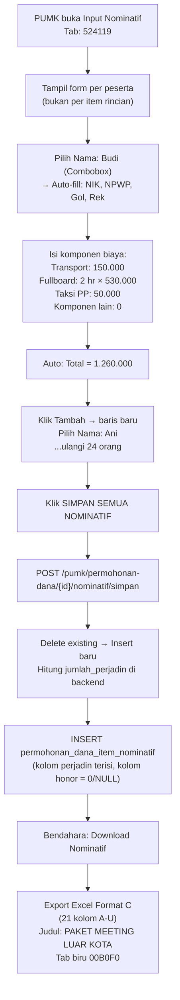

# Alur Pengisian Nominatif 524119 — Belanja Perjalanan Dinas Paket Meeting Luar Kota

## Jawaban Singkat

Pengisian dilakukan **per orang** dengan mengisi komponen-komponen biaya perjalanan dinas paket meeting: transport, uang harian (fullboard/fullday), representasi, taksi PP, tiket pesawat, dan hotel. Format C ini sama strukturnya dengan 524111, namun konteksnya adalah **kegiatan rapat/meeting di luar kota** yang biasanya menggunakan paket fullboard atau fullday.

---

## Siapa yang Mengisi?

| Role | Aksi |
|------|------|
| **PUMK (role pumk)** | Mengisi seluruh data nominatif per orang per item |
| **Bendahara** | Hanya klik "Download Nominatif" → Export Excel |

> [!IMPORTANT]
> **PUMK yang melakukan seluruh pengisian.** Bendahara hanya men-generate output Excel.

---

## Perbedaan 524119 vs 524111 vs 524113

| Aspek | 524119 (Paket Meeting LK) | 524111 (Perjadin Biasa LK) | 524113 (Dalam Kota) |
|-------|--------------------------|---------------------------|---------------------|
| Konteks | Rapat/meeting luar kota | Perjalanan dinas biasa luar kota | Perjalanan dinas dalam kota |
| Komponen utama | Fullboard/Fullday | Uang Harian Biasa + Hotel | Transport saja |
| Hotel | ✅ Bisa ada | ✅ Bisa ada | ❌ Tidak ada |
| Uang Harian Biasa | ✅ Bisa ada | ✅ Bisa ada | ❌ Tidak ada |
| Fullboard/Fullday | ✅ Utama | ✅ Bisa ada | ❌ Tidak ada |
| Format Excel | Format C (A–U, 21 kolom) | Format C (A–U, 21 kolom) | Format C (A–U, 21 kolom) |
| Tab color | Biru 00B0F0 | Biru 00B0F0 | Biru 00B0F0 |
| Referensi | Nomor ST + Tanggal ST | Nomor ST + Tanggal ST | Nomor ST + Tanggal ST |

---

## Alur Pengisian Step-by-Step

### Contoh Kasus:
```
524119 - Belanja Perjalanan Dinas Paket Meeting Luar Kota
├── 01 Uang Harian Fullboard  [24 ORG x 2 HR x 1 KEG]
├── 02 Transportasi Jakarta-Bandung  [24 ORG x 2 KL x 1 KEG]
└── 03 Taksi PP  [24 ORG x 1 KEG]
```

### Step 1: PUMK membuka halaman Input Nominatif

PUMK membuka halaman **Input Nominatif** dari permohonan dana yang berstatus `draft` atau `rejected`. Klik tab `524119`.

```
┌──────────────────────────────────────────────────────────────────────┐
│ Tab: [521213] [524119] ...                                          │
├──────────────────────────────────────────────────────────────────────┤
│ 524119 — Belanja Perjalanan Dinas Paket Meeting Luar Kota           │
│                                                                      │
│ ┌────┬──────────────┬───────────┬──────────────────────┬──────────┐  │
│ │ No │ Nama Peserta │ Transport │ Fullboard [Vol│Sat│Jml]│ Taksi PP│  │
│ ├────┼──────────────┼───────────┼──────────────────────┼──────────┤  │
│ │  1 │ [Combobox ▼] │ 150.000   │  2  │ 530.000 │ auto  │ 50.000  │  │
│ │  + Tambah Peserta                                               │  │
│ └─────────────────────────────────────────────────────────────────┘  │
└──────────────────────────────────────────────────────────────────────┘
```

> Untuk 524119, input per **peserta** (bukan per item rincian). Semua komponen biaya diisi dalam satu baris per orang.

### Step 2: PUMK mengisi data per orang

#### Field yang diisi PUMK:

| Field | Cara Input | Keterangan |
|-------|-----------|------------|
| **Nama Peserta** | Combobox searchable dari `ref_pegawai` | Ketik nama → pilih dari dropdown |
| **Transport** | Input angka | Biaya transport PP (bisa 0 jika tidak ada) |
| **Uang Harian Biasa — Vol** | Input angka | Jumlah hari uang harian biasa |
| **Uang Harian Biasa — Satuan** | Input angka | Harga per hari |
| **Fullboard — Vol** | Input angka | Jumlah hari fullboard |
| **Fullboard — Satuan** | Input angka | Harga per hari fullboard |
| **Fullday — Vol** | Input angka | Jumlah hari fullday/halfday |
| **Fullday — Satuan** | Input angka | Harga per hari fullday |
| **Representasi** | Input angka | Uang representasi pejabat (bisa 0) |
| **Taksi PP** | Input angka | Biaya taksi pulang-pergi (bisa 0) |
| **Tiket Pesawat** | Input angka | Harga tiket pesawat (bisa 0) |
| **Hotel** | Input angka | Biaya penginapan (bisa 0) |

> Isi **0** untuk komponen yang tidak ada. Sistem menghitung total otomatis.

#### Field yang otomatis terisi saat pilih nama:

| Field | Sumber |
|-------|--------|
| NIK | `ref_pegawai.nik` |
| NPWP | `ref_pegawai.npwp` |
| Gol/Ruang | `ref_pegawai.gol_ruang` |
| Nama Rekening | `ref_pegawai.nama_rekening` |
| Nomor Rekening | `ref_pegawai.norek` |
| Bank | `ref_pegawai.nama_bank` |
| Email | `ref_pegawai.email` |

### Step 3: Kalkulasi otomatis

```
uang_harian_jumlah  = uang_harian_vol × uang_harian_satuan
fullboard_jumlah    = fullboard_vol × fullboard_satuan
fullday_jumlah      = fullday_vol × fullday_satuan

jumlah_perjadin = transport
                + uang_harian_jumlah
                + fullboard_jumlah
                + fullday_jumlah
                + representasi
                + taksi_pp
                + tiket_pesawat
                + hotel
```

Contoh peserta paket meeting fullboard:
```
Transport:    150.000
Fullboard:    2 hari × 530.000 = 1.060.000
Taksi PP:     50.000
─────────────────────
Total:        1.260.000
```

### Step 4: Simpan semua

Klik tombol **"Simpan Semua Nominatif"** → semua data dikirim ke `POST /pumk/permohonan-dana/{id}/nominatif/simpan`.

---

## Detail Teknis Penyimpanan

### Tabel `permohonan_dana_item_nominatif` — kolom yang dipakai untuk 524119:

```
permohonan_dana_item_id  → FK ke item 524119
permohonan_dana_id       → FK ke permohonan
ref_pegawai_id           → FK ke ref_pegawai
nama, nip, nik, npwp, gol_ruang, nama_rekening, norek, nama_bank, email  → snapshot
jabatan                  → NULL (tidak dipakai untuk perjadin)
pph21                    → 0 (tidak ada PPh21 untuk perjadin)
-- Komponen perjadin:
transport                → biaya transport
uang_harian_vol          → jumlah hari uang harian biasa
uang_harian_satuan       → harga per hari
uang_harian_jumlah       → vol × satuan
fullboard_vol            → jumlah hari fullboard
fullboard_satuan         → harga per hari fullboard
fullboard_jumlah         → vol × satuan
fullday_vol              → jumlah hari fullday
fullday_satuan           → harga per hari fullday
fullday_jumlah           → vol × satuan
representasi             → uang representasi
taksi_pp                 → biaya taksi PP
tiket_pesawat            → harga tiket
hotel                    → biaya hotel
jumlah_perjadin          → total semua komponen
```

> Kolom honor (`jumlah_bruto`, `jumlah_pajak`, `jumlah_diterima`) **tidak dipakai** untuk kode perjadin.

---

## Format Excel Output (Format C)

Header baris 11–13:

```
No | Nama | Transport (Rp) | Uang Harian Biasa [Jml Hari | Satuan | Jumlah] | Uang Harian Fullboard [Jml Hari | Satuan | Jumlah] | Uang Harian Fullday [Jml Hari | Satuan | Jumlah] | Uang Representasi | Taksi PP | Tiket Pesawat | Akomodasi Hotel | Jumlah Diterima (Rp) | Atas Nama Rekening | Nomor Rekening | Bank | Email
```

Kolom A–U (21 kolom).

Header (baris 1–13, dari kode asli controller — **identik dengan 524111**):
```
Baris 1: "Lampiran :"
Baris 2: "Surat Keputusan Kepala LLDIKTI Wilayah III selaku KPA"
Baris 3: "Nomor : {no_st} Tanggal {tgl_st}"   ← pakai ST, bukan SK
Baris 5: "DAFTAR PEMBAYARAN TRANSPORT DAN UANG HARIAN PERJALANAN DINAS"
Baris 6: "KEGIATAN {JUDUL_KEGIATAN_UPPERCASE}"
Baris 7: "DI LINGKUNGAN LEMBAGA LAYANAN PENDIDIKAN TINGGI WILAYAH III JAKARTA TAHUN ANGGARAN {tahun}"
Baris 8: "DI {TEMPAT_UPPERCASE} TANGGAL {tgl_pelaksanaan_uppercase}"
Baris 9: "524119 {nama_subkegiatan}"
```

Data header kolom (baris 11–13):
```
Baris 11: No | Nama | Transport (Rp.) | Uang Harian Biasa | Uang Harian Fullboard | Uang Harian Fullday | Uang Representasi | Taksi PP | Tiket Pesawat | Akomodasi Hotel | Jumlah Diterima (Rp) | Atas Nama Rekening | Nomor Rekening | Bank | Email
Baris 12: (sub-header: Jml Hari | Satuan | Jumlah — untuk masing-masing Harian/Fullboard/Fullday)
Baris 13: A | B | C | D | E | F=DxE | G | H | I=GxH | J | K | L=JxK | M | N | O | P | Q=C+F+I+L | R | S | T | U
```

> [!IMPORTANT]
> **Format Excel 524119 IDENTIK dengan 524111** — controller menggunakan blok `else if` yang sama: `524111 || 524119`. Judul sheet pun sama: "DAFTAR PEMBAYARAN TRANSPORT DAN UANG HARIAN PERJALANAN DINAS". Perbedaan hanya di konteks penggunaan (paket meeting vs perjadin biasa).

Tab color Excel: **00B0F0** (biru — kode perjadin).

---

## Diagram Alur Lengkap



---

## Kesimpulan

| Pertanyaan | Jawaban |
|-----------|---------|
| **Input per orang atau per item?** | **Per orang.** Semua komponen biaya diisi dalam satu baris per peserta. |
| **Ada PPh21?** | **Tidak.** Perjadin tidak dipotong PPh21. |
| **Ada kolom Jabatan?** | **Tidak.** Format C tidak punya kolom jabatan. |
| **Komponen utama 524119?** | Fullboard/Fullday (paket meeting). Transport, taksi, hotel bisa ada. |
| **Referensi dokumen?** | **Nomor ST** (Surat Tugas) dan Tanggal ST — bukan SK. |
| **Kolom Excel berapa?** | **21 kolom (A–U).** |
| **Warna tab Excel?** | **Biru (00B0F0)** — sama dengan semua kode perjadin. |
